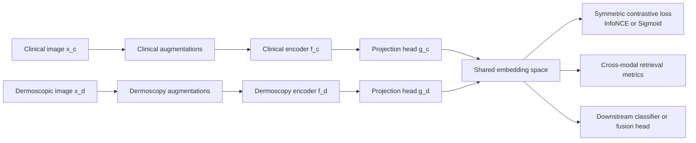
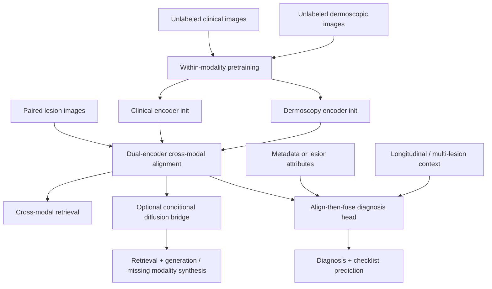

# Dual-Encoder and Contrastive Learning for Paired Clinical and Dermoscopic Images

## Executive summary

Paired clinical ↔ dermoscopic images are an unusually good fit for **dual-encoder contrastive learning** because the two images share lesion identity and much of the diagnostic signal, while differing strongly in field of view, scale, color statistics, fine texture visibility, and surrounding context. That makes the problem structurally closer to **multiview contrastive learning** and **cross-modal retrieval** than to plain same-image SimCLR. In practice, the most transferable ideas come from five families: **visual SSL** such as SimCLR and MoCo; **negative-free/self-distillation** methods such as BYOL and DINO; **dual-encoder cross-modal alignment** such as CLIP and SigLIP; **image-image common-space learning** such as CMC and CoMIR; and **medical paired learning** such as MICLe, ConVIRT, and the recent skin-lesion-specific SM3 framework. citeturn27view0turn29view1turn30view0turn32search0turn26view0turn41search0turn40search0turn25search0turn23search10turn8search4turn22search6

For **clinical↔dermoscopic pairing**, the most defensible starting point is an **untied dual encoder**: one encoder for clinical photos, one for dermoscopy, both mapped through modality-specific projection heads into a shared embedding space, trained with a **symmetric contrastive loss** \(clinical→derm and derm→clinical\). If batches are small, a **MoCo-style queue** or a **SigLIP-style pairwise sigmoid loss** is more practical than pure SimCLR. If labels exist, the strongest downstream pattern is **align first, fuse second**: first pretrain dual encoders contrastively, then add a light fusion head or cross-attention module for diagnosis / seven-point checklist prediction. citeturn29view1turn41search0turn26view0turn41academia13turn22search11turn22search6

The closest direct precedent to your use case is **Self-Supervised Multi-Modality Learning for Multi-Label Skin Lesion Classification** \(SM3\), which explicitly contrasts paired dermoscopic and clinical images and augments that with pseudo multi-label attribute learning on Derm7pt. Two other papers matter disproportionately for design intuition: **MICLe**, because it treats multiple images of the same pathology/patient as positive pairs, and **CoMIR**, because it is one of the clearest image↔image cross-modal shared-representation papers rather than an image↔text paper. citeturn22search2turn23search10turn25search0

The main practical bottleneck is not the loss; it is **data geometry**. Public paired clinical+dermoscopic datasets are still small compared with CLIP-style corpora. Derm7pt has **1011 lesion cases** with paired clinical and dermoscopic images and labels; HIBA contains **1,616 images from 1,246 lesions** with both dermoscopy and clinical images present in some cases but not necessarily fully paired for every lesion; the University of Queensland longitudinal dataset provides **clinical-quality tile images** and corresponding dermoscopy for **9,389 lesions**, with longitudinal follow-up for many participants. These datasets are excellent for evaluation and adaptation, but they are not large enough to make a naive CLIP-from-scratch recipe automatically optimal. citeturn12view0turn34view0turn36view0

Because your exact dataset, label taxonomy, pathology-confirmation rate, pairing completeness, and compute budget are unspecified, the report below emphasizes **robust design choices** and **ablation paths** rather than a single rigid recipe.

## Method landscape for clinical and dermoscopic pairing

A useful mental model is that paired clinical and dermoscopic images are **two views of the same latent lesion state**. The clinical image contributes macroscopic context \(shape, border in surrounding skin, body-site context, sometimes skin-tone/background cues\), while dermoscopy contributes fine structures \(pigment network, dots/globules, streaks, vessels, veil, regression, etc.\). Multiview contrastive learning was built exactly for situations where distinct views share semantic factors but differ in nuisance factors, and CMC explicitly argued that representation quality improves when learning from multiple views. citeturn40search0turn12view0

The first architecture decision is whether to use a **shared encoder** \(tied weights\) or **two separate encoders** \(untied weights\). Shared encoders are parameter-efficient and natural when the two modalities differ only mildly; this is the usual setup in SimCLR/BYOL/DINO-style same-modality SSL. Separate encoders are more appropriate when the modalities differ substantially, which is the case for clinical vs dermoscopic images. CLIP, CoMIR, and SM3 all fit the separate-encoder intuition better than pure shared-weight Siamese learning. For your setting, a shared encoder is still worth keeping as an ablation, but **untied weights should be the default baseline**. citeturn27view0turn30view0turn32search0turn26view0turn25search0turn22search6

A second design choice is whether the system should stop at **alignment** or continue into **fusion**. Dual encoders excel at retrieval, indexing, and scalable representation learning, because each modality gets its own embedding and nearest-neighbor lookup becomes straightforward. But diagnosis often needs **joint reasoning** across modalities. This is why an “**align-before-fuse**” pattern is attractive: first learn robust shared representations with a dual encoder, then add light cross-attention / fusion for classification. ALBEF formalized this intuition in vision-language by aligning representations before applying cross-modal attention, and SkinM2Former shows the same general principle in multimodal skin-lesion classification using tri-modal cross-attention. citeturn41academia13turn22search11

A third design choice is whether to operate only on **global embeddings** or to add **local alignment**. Clinical↔dermoscopy pairs are not just different styles of the same image; they also differ in crop extent and scale. Local structures often carry the diagnostic load. GLoRIA’s global-local contrastive design and DINO’s emergent object/region structure both support the idea that local alignment should matter. For lesion pairs, patch-level or lesion-region-level alignment is therefore a strong second-stage extension after a simpler global dual encoder is working. citeturn8search1turn32search0

A compact comparison is below.

| Architecture pattern | What it means | Strengths | Main risk | Best role for clinical↔dermoscopy |
|---|---|---|---|---|
| Shared encoder | Same weights for both modalities | Simple, fewer params, strong regularization | Underfits modality-specific cues | Useful ablation; not my first choice. citeturn27view0turn30view0turn32search0 |
| Separate encoders + shared embedding | One branch per modality, align in common latent space | Best fit for heterogeneous paired views; natural for retrieval | Needs careful normalization / balancing | Recommended default. citeturn26view0turn25search0turn22search6 |
| Align then fuse | Contrastive pretrain first, then cross-attention / late fusion | Combines scalable pretraining with stronger diagnosis head | More moving parts | Recommended if labels exist. citeturn41academia13turn22search11 |
| Common representation for aligned images | Learn image-like shared structures across modalities | Strong for registration / dense matching | Assumes alignment quality matters | Promising for lesion-region correspondence and patch retrieval. citeturn25search0turn24search0 |
| Generative bridge | Diffusion or translation from one modality to the other | Enables retrieval+generation and synthesis of missing modality | Can optimize appearance rather than diagnosis | Good as a second-stage extension, not first-line pretraining. citeturn6search0turn7search20 |

## Losses and training patterns that transfer well

The core algebra still comes from **InfoNCE / NT-Xent**. CPC introduced the contrastive predictive coding view and the probabilistic contrastive loss that later became standard in vision contrastive learning. SimCLR popularized the normalized temperature-scaled cross-entropy variant \(NT-Xent\), emphasizing that augment composition, projection heads, temperature, large batch size, and long training all matter materially. citeturn39search0turn27view0

For an anchor embedding \(q\), positive \(k^+\), negatives \(k_j\), and temperature \(\tau\), a standard form is

\[
\mathcal L_{\text{InfoNCE}}(q,k^+) =
-\log \frac{\exp(\mathrm{sim}(q,k^+)/\tau)}
{\sum_{j}\exp(\mathrm{sim}(q,k_j)/\tau)} .
\]

MoCo used this exact family of losses and added the key engineering insight for small-batch regimes: a **queue of negatives** plus a **momentum-updated key encoder**, which decouples dictionary size from minibatch size. That is extremely relevant in medical settings where fully paired batches may be small. A MoCo-style clinical↔dermoscopy model is therefore a realistic baseline when the number of paired cases is limited. citeturn29view0turn29view1

CLIP showed the modern **symmetric dual-encoder** recipe: given a batch of paired examples, train image and text encoders jointly so that the real pairs are close in a shared space and all incorrect pairings are far apart, optimizing a symmetric cross-entropy over the full similarity matrix. For clinical↔dermoscopy, the direct analogue is a **clinical-to-derm** loss plus a **derm-to-clinical** loss, averaged together. This usually works better than a one-sided objective because both retrieval directions matter clinically. citeturn26view0

When batch size is the constraint, **SigLIP** is especially interesting. Instead of global softmax normalization over all pairwise similarities, it uses a **pairwise sigmoid loss** that operates directly on positive and negative pairs and is explicitly reported to behave better at smaller batch sizes while also scaling very large. For paired skin images, this is attractive because it reduces the tendency to over-couple loss quality to very large synchronized batches. citeturn41search0turn41search4

Hard negatives are useful, but they need clinical care. **VSE++** showed that hard-negative mining can improve cross-modal retrieval embeddings. However, **MedCLIP** also articulated a problem that is very familiar in medicine: semantically similar examples can become **false negatives** if sampling ignores latent similarity. In clinical↔dermoscopy, lesions from different patients with the same diagnosis or very similar morphology may be “easy” semantic neighbors but still become negatives under naive in-batch sampling. That suggests two sane rules: first, start with ordinary in-batch negatives before aggressive hard-negative mining; second, if metadata or labels are available, exclude suspiciously similar negatives or use diagnosis-aware debiasing. citeturn38search0turn8search2

Negative-free or weakly negative methods matter because paired medical datasets are often small. **BYOL** uses online and target networks with a predictor and moving-average target, avoiding explicit negatives. **DINO** extends self-distillation with a momentum teacher and multi-crop, and found momentum encoders and multi-crop important in ViT settings. **VICReg** and **Barlow Twins** are also worth considering when negatives are noisy or sparse, because they avoid collapse through variance / covariance or redundancy-reduction regularization rather than explicit negative pairs. These methods are best seen not as replacements for cross-modal contrastive learning, but as **within-modality regularizers or pretraining stages** for each branch before cross-modal alignment. citeturn30view0turn32search0turn17search1turn17search2

The most clinically relevant training insight comes from **MICLe**: if a patient case naturally has multiple images of the same pathology, those distinct images can define more meaningful positive pairs than two crops of one image. That is almost exactly your use case. A clinical photo and a dermoscopic image of the same lesion are stronger, more medically meaningful positives than two random crops of the same clinical image. This is one of the strongest conceptual arguments for a dual-encoder lesion-pair pretraining stage. citeturn23search1turn23search10

In dermatology specifically, **SM3** already demonstrates the key idea: maximize similarity between paired dermoscopic and clinical images, and combine this with pseudo multi-label structure from lesion attributes. That makes SM3 the closest “do this first” paper for your target problem. citeturn22search0turn22search6

## Prioritized paper list

The table below is ordered by how directly each paper informs a **paired clinical↔dermoscopic dual-encoder program**.

| Priority | Title | Authors | Year | Venue | Short summary | Why relevant to clinical↔dermoscopic pairing | PDF |
|---|---|---:|---:|---|---|---|---|
| High | Representation Learning with Contrastive Predictive Coding citeturn39search0 | van den Oord et al. | 2018 | arXiv | Introduced CPC / InfoNCE: predictive contrastive learning with negative sampling. | Best starting point for understanding the loss family behind most later dual-encoder methods. | [PDF](https://arxiv.org/pdf/1807.03748.pdf) |
| High | A Simple Framework for Contrastive Learning of Visual Representations citeturn27view0 | Chen et al. | 2020 | ICML | SimCLR: strong augmentations, nonlinear projection head, NT-Xent, large batches. | Canonical image-side baseline; projection heads and temperature tuning transfer directly. | [PDF](https://proceedings.mlr.press/v119/chen20j/chen20j.pdf) |
| High | Momentum Contrast for Unsupervised Visual Representation Learning citeturn29view1 | He et al. | 2020 | CVPR | Queue-based dictionary with momentum encoder; decouples negatives from batch size. | Very useful when paired medical batches are small. | [PDF](https://openaccess.thecvf.com/content_CVPR_2020/papers/He_Momentum_Contrast_for_Unsupervised_Visual_Representation_Learning_CVPR_2020_paper.pdf) |
| High | Contrastive Multiview Coding citeturn40search0 | Tian et al. | 2020 | ECCV | Extends contrastive learning to arbitrary views; more views can improve representation quality. | Closest foundational multiview paper for lesion-pair learning across modalities. | [PDF](https://www.ecva.net/papers/eccv_2020/papers_ECCV/papers/123560749.pdf) |
| High | Learning Transferable Visual Models From Natural Language Supervision citeturn26view0 | Radford et al. | 2021 | arXiv | CLIP: dual encoders, shared embedding space, symmetric contrastive loss over paired similarity matrix. | The canonical scalable dual-encoder retrieval recipe; replace text with dermoscopy or clinical branch. | [PDF](https://arxiv.org/pdf/2103.00020.pdf) |
| High | CoMIR: Contrastive Multimodal Image Representation for Registration citeturn25search0turn25search2 | Pielawski et al. | 2020 | NeurIPS | Learns one network per modality on aligned images; maps them into common image-like representations with InfoNCE. | One of the cleanest **image↔image cross-modal** papers, not image↔text. | [PDF](https://proceedings.neurips.cc/paper_files/paper/2020/file/d6428eecbe0f7dff83fc607c5044b2b9-Paper.pdf) |
| High | Big Self-Supervised Models Advance Medical Image Classification citeturn23search1turn23search10 | Azizi et al. | 2021 | ICCV | Introduces MICLe: use multiple images of the same pathology/patient as positive pairs. | Direct conceptual match: clinical and dermoscopy of the same lesion are better positives than two crops. | [PDF](https://openaccess.thecvf.com/content/ICCV2021/papers/Azizi_Big_Self-Supervised_Models_Advance_Medical_Image_Classification_ICCV_2021_paper.pdf) |
| High | Self-Supervised Multi-Modality Learning for Multi-Label Skin Lesion Classification citeturn22search2turn22search6 | Wang et al. | 2025 | Computer Methods and Programs in Biomedicine | SM3 contrasts paired dermoscopic and clinical images and adds pseudo multi-label lesion-attribute learning. | Closest direct method paper for your target setup. | [PDF](https://arxiv.org/pdf/2310.18583.pdf) |
| High | A Novel Perspective for Multi-Modal Multi-Label Skin Lesion Classification citeturn22search11turn22search8 | Zhang et al. | 2025 | WACV | SkinM2Former uses tri-modal cross-attention transformer fusion and multi-head label modeling on Derm7pt. | Strong supervised/fusion baseline after contrastive pretraining. | [PDF](https://openaccess.thecvf.com/content/WACV2025/papers/Zhang_A_Novel_Perspective_for_Multi-Modal_Multi-Label_Skin_Lesion_Classification_WACV_2025_paper.pdf) |
| High | A General-Purpose Multimodal Foundation Model for Dermatology citeturn20search1turn20search5 | Yan et al. | 2024/2025 | arXiv / Nature Medicine | PanDerm pretrains on over 2M dermatology images across 4 modalities and transfers broadly. | Not a lesion-pair dual encoder per se, but the most important recent dermatology-specific multimodal foundation reference. | [PDF](https://arxiv.org/pdf/2410.15038.pdf) |
| Medium | Bootstrap Your Own Latent citeturn30view0 | Grill et al. | 2020 | NeurIPS | Online/target networks + predictor, no explicit negatives. | Good for branch-wise pretraining when negatives are unreliable. | [PDF](https://papers.nips.cc/paper_files/paper/2020/file/f3ada80d5c4ee70142b17b8192b2958e-Paper.pdf) |
| Medium | Emerging Properties in Self-Supervised Vision Transformers citeturn32search0 | Caron et al. | 2021 | ICCV | DINO: momentum teacher, multi-crop, self-distillation with ViTs. | Useful for initialization and for local/patch-sensitive visual structure. | [PDF](https://openaccess.thecvf.com/content/ICCV2021/papers/Caron_Emerging_Properties_in_Self-Supervised_Vision_Transformers_ICCV_2021_paper.pdf) |
| Medium | Sigmoid Loss for Language Image Pre-Training citeturn41search0turn41search4 | Zhai et al. | 2023 | ICCV | Replaces softmax contrastive normalization with a pairwise sigmoid loss. | Attractive when paired lesion batches are modest and CLIP-style softmax is brittle. | [PDF](https://openaccess.thecvf.com/content/ICCV2023/papers/Zhai_Sigmoid_Loss_for_Language_Image_Pre-Training_ICCV_2023_paper.pdf) |
| Medium | VSE++: Improving Visual-Semantic Embeddings with Hard Negatives citeturn38search0turn38search2 | Faghri et al. | 2018 | BMVC | Cross-modal retrieval embeddings with hard-negative ranking loss. | Useful blueprint for lesion-pair retrieval and hard-negative ablations. | [PDF](https://bmva-archive.org.uk/bmvc/2018/contents/papers/0344.pdf) |
| Medium | Contrastive Learning of Medical Visual Representations from Paired Images and Text citeturn8search4 | Zhang et al. | 2022 | MLR | ConVIRT: bidirectional medical image-text contrastive pretraining improves data efficiency. | Image-text rather than image-image, but a key medical-domain contrastive reference. | [PDF](https://proceedings.mlr.press/v182/zhang22a/zhang22a.pdf) |
| Medium | GLoRIA: A Multimodal Global-Local Representation Learning Framework for Label-Efficient Medical Image Recognition citeturn8search1 | Huang et al. | 2021 | ICCV | Adds global-local alignment between image regions and report words. | Inspires patch-level / local-structure alignment for lesion pairs. | [PDF](https://openaccess.thecvf.com/content/ICCV2021/papers/Huang_GLoRIA_A_Multimodal_Global-Local_Representation_Learning_Framework_for_Label-Efficient_Medical_ICCV_2021_paper.pdf) |
| Medium | MedCLIP: Contrastive Learning from Unpaired Medical Images and Text citeturn8search2 | Wang et al. | 2022 | EMNLP | Uses unpaired medical images/text and semantic matching to reduce false negatives. | Useful if your lesion pairs are incomplete or weakly paired. | [PDF](https://arxiv.org/pdf/2210.10163.pdf) |
| Medium | Multi-modal Vision Pre-training for Medical Image Analysis citeturn16search4 | Rui et al. | 2025 | CVPR | Uses cross-modal reconstruction plus cross-modal contrastive learning for medical imaging. | Strong recent template for combining alignment and reconstruction in multimodal medicine. | [PDF](https://openaccess.thecvf.com/content/CVPR2025/papers/Rui_Multi-modal_Vision_Pre-training_for_Medical_Image_Analysis_CVPR_2025_paper.pdf) |

A pattern emerges from these papers. The most directly useful stack is: **MICLe intuition for positives**, **CLIP/SigLIP style symmetric dual encoders**, **MoCo if batches are small**, **SM3 as the domain-specific precedent**, and **align-then-fuse** for downstream classification. citeturn23search10turn26view0turn41search0turn29view1turn22search6turn41academia13

## Datasets, benchmarks, and evaluation

The public dataset situation is mixed. There are now multiple dermatology datasets that include both clinical-like and dermoscopic views, but full same-lesion pairing is still relatively scarce, and pathology-confirmed melanoma counts remain modest in many collections. citeturn12view0turn34view0turn36view0

| Dataset / benchmark | Modalities | What is publicly clear | Why it matters |
|---|---|---|---|
| Derm7pt citeturn12view0turn11view1 | Clinical + dermoscopy + metadata | Official paper benchmarks **1011 lesion cases**; public dataset/repo tied to seven-point checklist and diagnosis. | Best classic benchmark for true paired lesion images and attribute labels. |
| HIBA Argentina citeturn34view0 | Clinical + dermoscopy + metadata | **1,616 images**, **1,246 lesions**, **623 patients**; some lesions have both image types, but full pair coverage for every lesion is not guaranteed in the descriptor. | Excellent external dataset for partial pairing, robustness, and Latin American population shift. |
| UQ longitudinal tile↔dermoscopy dataset citeturn36view0 | Clinical-quality tile images + dermoscopy + metadata + time | **250,162 tile-image lesions**, corresponding dermoscopy for **9,389 lesions**, longitudinal follow-up for many participants. | Very strong for multiview positives, “ugly duckling” context, and longitudinal MIL. |
| PAD-UFES-20 citeturn35search0turn35search1turn35search2 | Clinical images + metadata | **2,298 images** from **1,373 patients**; clinical-only, no dermoscopy. | Ideal to pretrain / adapt the clinical-photo branch and test domain adaptation. |
| ISIC-DICM-17K citeturn13search9 | Dermoscopy + clinical metadata | Balanced dermoscopic image collection with metadata, not paired clinical photos. | Useful for metadata fusion baselines, not for image↔image alignment itself. |
| MS COCO / Flickr30K / Conceptual Captions / LAION citeturn37search0turn37search5turn37search6turn37search15 | General image-text | Standard cross-modal retrieval and large-scale pretraining corpora. | Useful to validate retrieval codepaths, loss implementations, and scaling behavior before medical transfer. |

For evaluation, I would separate **representation quality** from **clinical utility**. Retrieval is the most natural first task for a dual encoder. Use **Recall@K** \(R@1, R@5, R@10\), **MRR**, and median rank for clinical→derm and derm→clinical retrieval. VSE++, CLIP, GLoRIA, and broader retrieval literature all rely on retrieval-oriented metrics of this kind. In dermatology specifically, content-based retrieval has also been studied as decision support, which makes retrieval more than a proxy metric here. citeturn38search2turn26view0turn8search1turn18search15turn18search17

For diagnosis/classification, report **AUROC**, **balanced accuracy**, **macro-F1**, per-class sensitivity/specificity, and calibration if possible. Balanced metrics matter because paired lesion datasets are usually imbalanced. If the downstream task includes the seven-point checklist or other multi-label structure, use **mean average accuracy / mAP-like multilabel summaries** plus per-attribute AUROC as in recent Derm7pt work. citeturn22search11turn22search6

If you extend to **retrieval + generation**, image-quality scores alone are not enough. General paired image-to-image diffusion work such as Palette shows how diffusion can handle generic image translation tasks, and SynDiff shows conditional diffusion is viable for medical modality translation; but for dermatology the key question is whether generated images preserve **diagnostic morphology**, not just realism. So add downstream diagnosis consistency, dermatologist retrieval assessment, or lesion-attribute preservation checks on top of perceptual metrics such as LPIPS / SSIM / PSNR / FID. citeturn6search0turn7search20

## Proposed research agenda for clinical and dermoscopic pairs

A strong practical pipeline is **three-stage**. First, pretrain each modality branch on all available unlabeled images using a strong unimodal SSL method \(DINO/BYOL/SimCLR family\). Second, align the two modalities with a symmetric dual-encoder objective on paired lesions. Third, fine-tune either for pure retrieval or for diagnosis using an align-then-fuse head. This mirrors the successful pretrain→adapt→fine-tune logic seen in MICLe, ConVIRT, PanDerm, and recent multimodal medical pretraining work. citeturn30view0turn32search0turn27view0turn23search10turn8search4turn20search0turn16search4

The concrete starting configuration I would prioritize is below.

| Component | Recommended first setting | Why |
|---|---|---|
| Encoders | Two separate encoders of the same backbone family \(e.g., ViT-S/16 or ResNet-50\) | Separate weights handle modality gap better than tied weights, while keeping architecture comparable for ablations. Inspired by CLIP, CoMIR, SM3. citeturn26view0turn25search0turn22search6 |
| Projection heads | Small modality-specific MLP heads to a shared 256-d or 512-d space | SimCLR and CLIP-style training strongly benefit from a learned projection space. citeturn27view0turn26view0 |
| Core loss | Symmetric InfoNCE by default; SigLIP if batches are small or unstable | CLIP gives the canonical symmetric form; SigLIP relaxes batch dependence. citeturn26view0turn41search0 |
| Positives | Same-lesion clinical↔derm pair; add augmentations within each modality | This is the medically meaningful positive advocated by MICLe-style reasoning. citeturn23search10 |
| Small-batch strategy | MoCo queue \(16k–65k negatives\) or SigLIP | MoCo and SigLIP directly address batch-size constraints. citeturn29view1turn41search0 |
| Temperature / scaling | Learnable temperature; initialize near classic CLIP/SimCLR ranges rather than fixing blindly | Both SimCLR and CLIP emphasize temperature/logit-scale sensitivity. citeturn27view0turn26view0 |
| Downstream head | Late fusion or light cross-attention over frozen/finetuned branch embeddings | Align-then-fuse is the safest progression for diagnosis. citeturn41academia13turn22search11 |
| Multi-label extension | Add diagnosis + seven-point attribute supervision when available | Exactly what recent Derm7pt-centered work benefits from. citeturn22search6turn22search11 |

The ablation program should be short but sharp. The most informative experiments are usually not “bigger vs smaller backbone” but **representation assumptions**:

| Ablation | What to test | Why it matters |
|---|---|---|
| Shared vs separate encoders | Tied weights vs untied weights | Tests whether modality gap is large enough to justify separate branches. |
| InfoNCE vs SigLIP vs queue-based MoCo | Same backbone, same pairs | Identifies whether your regime is batch-limited or false-negative-limited. |
| Pair positives vs crop positives | Same lesion cross-modality vs same-image augmentations only | Direct test of the MICLe intuition for your data. |
| Global-only vs global+local alignment | CLS embedding only vs patch-alignment auxiliary loss | Tests whether fine dermoscopic structures require local matching. |
| Retrieval pretrain only vs align-then-fuse | Frozen embeddings vs fused classifier | Measures whether classification gains come from alignment alone or true joint reasoning. |
| Labels-aware negative filtering | Exclude same-diagnosis / same-patient / near-duplicate negatives | Tests false-negative sensitivity, as highlighted by MedCLIP-style concerns. |
| Partial-pair robustness | Randomly drop one modality for a fraction of training cases | Simulates HIBA/UQ-style incompleteness and real deployment missingness. |
| Longitudinal / multi-lesion extension | Use multiple lesions or timepoints per patient as multi-positive bags | Captures ugly-duckling and temporal change signals. citeturn8search2turn24search9turn36view0 |

Two higher-risk, higher-upside ideas stand out.

The first is **dual-encoder pretraining plus conditional diffusion**. Train aligned clinical and dermoscopic encoders first, then condition a paired image-to-image diffusion model on the aligned embedding or on nearest retrieved same-diagnosis neighbors. This is more plausible than training diffusion from scratch on tiny paired data because the representation space already encodes lesion correspondences. Palette and SynDiff support the generative side of this idea, but I would treat it as a second-phase project after retrieval and classification are stable. citeturn6search0turn7search20

The second is **multi-view MIL** \(multiple-instance learning\) over lesions and/or time. The UQ longitudinal dataset and MICLe both point toward a richer positive-pair definition: not just one clinical↔derm pair, but sets of same-patient lesions or same-lesion timepoints. That is especially attractive if your eventual clinical workflow is triage, surveillance, or ugly-duckling-style comparison rather than isolated single-lesion classification. citeturn23search10turn36view0

## Recommended next steps and open questions

The fastest high-value path is:

| Horizon | Recommended step | Expected outcome |
|---|---|---|
| Immediate | Reproduce three baselines on your paired data: clinical-only, derm-only, and symmetric clinical↔derm dual encoder | Establish whether pairing adds value beyond strong unimodal models. |
| Immediate | Use retrieval as the first target task \(R@1/R@5 + AUROC after linear probe\) | Separates representation quality from fusion/classifier complexity. |
| Short-term | Run the core ablations: untied vs tied, InfoNCE vs SigLIP, pair-positives vs crop-positives | Usually enough to identify the correct loss/architecture family. |
| Short-term | Add diagnosis + attribute supervision on top of the aligned encoders | Tests whether contrastive alignment transfers into clinical prediction. |
| Mid-term | Add local alignment and/or cross-attention fusion | Should matter if dermoscopic microstructures are not well captured globally. |
| Mid-term | Test domain adaptation across sources \(e.g., Derm7pt→HIBA or clinical-only PAD-UFES-style transfer\) | Evaluates robustness to device/population shift. citeturn10search15turn34view0turn35search0 |
| Longer-term | Explore retrieval+generation or longitudinal multi-view MIL | Higher upside, higher complexity. |

The biggest unresolved questions are mostly data-side rather than model-side. The exact fraction of fully paired lesions in your target dataset is unspecified. The diagnosis ontology and whether attribute labels exist are unspecified. Pathology-confirmation coverage is unspecified. The intended deployment target is also unspecified: pure classification, retrieval-based decision support, missing-modality imputation, or longitudinal monitoring. Those choices materially affect whether the best next paper to imitate is **SM3**, **CLIP/SigLIP**, **MICLe**, **SkinM2Former**, or a **contrastive+diffusion** hybrid. On the public-data side, fully paired clinical↔dermoscopic datasets remain small, population diversity is limited in several collections, and melanoma counts are still modest outside broader proprietary programs such as PanDerm. citeturn22search6turn26view0turn41search0turn23search10turn22search11turn34view0turn36view0turn20search0

If I had to reduce the whole report to one sentence, it would be this: **treat clinical and dermoscopic images as medically meaningful multiview positives of the same lesion, learn them with an untied symmetric dual encoder, and only then add fusion or generation.** That is the most evidence-aligned path from the current literature to a practical clinical↔dermoscopic system. citeturn40search0turn26view0turn23search10turn22search6